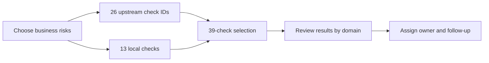

# Entra posture smoke tests

Focused Entra posture monitoring: **curated Maester check IDs → local assertions → reviewable evidence → remediation**. This is a sanitised reference, not a tenant-connected deployment. A report is useful only if somebody can tell what changed and who should act. PDF length is not a control. The short account is [Smoking alarm for Entra](https://iam.felixelliott.com/posts/maester-entra-posture/).

## Visual overview



The three domains are application lifecycle and ownership, authentication and credentials, and **Conditional Access coverage and exclusions**. The third domain is relevant to non-human identities but contains **no direct MCP or agent checks**.

## Repository shape

```text
MaesterTags.json                  39 selected IDs grouped by domain (not a Maester config file)
src/PostureChecks.psm1           13 clean-room, offline custom checks
maester-tests/README.md          Maester usage and severity guidance
maester-tests/Custom/            Pester adapter plus custom-test guidance
fixtures/                        Fabricated snapshots and explicitly simulated results
tests/check-synthetic.ps1        Local validation without a tenant connection
docs/MaesterTags.md              Why each group is in the selected set
```

The 26 built-in IDs refer to Maester/CISA checks. Their implementations are **not copied** into this repository. The 13 custom checks evaluate a supplied JSON snapshot. No collector, token, tenant configuration, upstream library snapshot, production report or analytics database is included. `.gitignore` admits only the three named synthetic fixtures under `fixtures/` and excludes common result, database and credential files; still review every commit.

## Executive summary

| Domain | Selected | Upstream IDs | Local checks |
| --- | ---: | ---: | ---: |
| Application lifecycle and ownership | 16 | 10 | 6 |
| Authentication and credentials | 14 | 10 | 4 |
| Conditional Access coverage and exclusions | 9 | 6 | 3 |
| **Total** | **39** | **26** | **13** |

In one earlier selected lab run, the 39 checks took **about two and a half minutes** (~147 seconds wall time). That is historical context, **not** a runtime measurement of this repo, a production assurance claim or proof of a nightly scheduler. A check that takes three coffees and a change window rarely becomes routine.

## What this measures

The upstream list provides established policy checks. The local rules cover questions a generic catalogue cannot answer without a local policy: risky requested Graph permissions and their approval, ownership and recent review, credential expiry, and Conditional Access exceptions. See [the selection rationale](docs/MaesterTags.md) for the exact IDs.

The evaluator works on an operator-supplied snapshot with `applications`, `servicePrincipals`, `conditionalAccessPolicies` and `config` keys. The [synthetic fixture](fixtures/snapshot.json) documents its minimal schema, and the [module header](src/PostureChecks.psm1) names required fields. Missing evidence on an applicable object is a failure, not a comforting green tick. A collector that exports real Entra data would require separate review and is deliberately out of scope.

## Why the scope is deliberately small

The full catalogue offers breadth. Selected upstream checks are cheap but cannot know local ownership or exception rules. Local-only checks would reimplement existing controls. A 26-plus-13 selection covers the chosen questions without confusing the number of findings with their value.

The original operating pattern was to fetch relevant inventory once, cache it, then make small assertions. This public reference starts **after** collection; it does not fetch live inventory. Dull is good here. Dull runs again next week.

## What each run produces

`fixtures/example-results.json` contains **synthetic, illustrative data** for all 39 IDs. Its 26 upstream entries are marked `illustrative-not-evaluated`; the 13 local entries match the fabricated snapshot at its fixed sample clock. They are **not** a real Maester result and must not be presented as one.

The offline module returns an ID, domain, pass/fail flag and violation count per local check. The optional Pester adapter reports the same 13 checks against a reviewed snapshot. In a real operating environment, retain timestamped results, collection context and an owner for each failure; do not publish those outputs here.

## Trend layer

The original approach compared timestamped evidence packs and tracked repeated failures by domain. A useful future analytics layer would record run summaries, results, source hashes and review outcomes. **No DuckDB database, ingestion script, trend view or real run history is distributed here.** Four tidy charts cannot make missing evidence less missing.

## Operating loop

1. Select checks against explicit business risks.
2. Validate the collection method and run the checks under approved access.
3. Review failures by domain and assign an accountable owner.
4. Approve, document or remove exceptions; do not treat naming alone as approval.
5. Re-run, retain evidence and watch for changes over time.

## Try the synthetic example

Requires PowerShell 7; the Pester adapter additionally requires Pester. These commands **do not authenticate to Entra**:

```powershell
pwsh -NoProfile -File ./tests/check-synthetic.ps1
$env:POSTURE_SNAPSHOT_PATH = (Resolve-Path ./fixtures/clean-snapshot.json).Path
$env:POSTURE_NOW = '2026-01-15T00:00:00Z'
Invoke-Pester -Path ./maester-tests/Custom/Test-PostureSnapshot.Tests.ps1
```

`fixtures/snapshot.json` intentionally contains failures; `fixtures/clean-snapshot.json` is the passing control. `fixtures/example-results.json` shows the simulated 39-entry result. `POSTURE_NOW` fixes the clock for reproducibility; omit it only when evaluating a real, approved snapshot. Running the 26 upstream checks separately requires Maester and its source tests; this manifest alone does not execute them. See [Maester's test documentation](https://maester.dev/docs/tests/) and [the custom-test README](maester-tests/Custom/README.md).

## Provenance and release boundary

This is newly written reference code. Maester and CISA IDs are referenced, not redistributed as test source. Keep synthetic examples separate from real tenant data. Before using the evaluator with an organisation's data, confirm its policy schema and permissions and review the findings; no collection adapter or production validation is claimed. No licence for the new code has been selected yet—public visibility does not, by itself, grant reuse rights.
